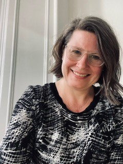

# Foreword by Dr Heather Cleland Woods {-}

 
 
**Wise Words by Bethany Shelton, Class of 2021**

---
I am writing this at my desk at home which is where I wrote the very first foreword for the Class of 2020 yearbook that started this annual tradition. We were in the very first lockdown and all the uncertainty that brought to us. I talk about resilience, supporting each other and, importantly, hope.  

Now I am writing this for you the Class of 2023, as we are preparing for the first Undergraduate Conference since 2019, back to celebrating your work together on campus, hurray! Resilience and support should still be acknowledged as you have had a university life that was so unexpected, but you have committed and kept going. We have been apart but now we are together. It has been a joy to be back on campus and I will never forget standing at my office window on the first day of teaching in September with a lump in my throat as I watched staff and students walk to class. Seeing you in class, in my student hours, through supervision or in whatever context we have bumped into each other has always been a positive for me. It also highlights that so much has changed while also staying the same. Compiling the yearbook has really shown me that being together is always so important. Your photos show that friendship and being with people that bring positivity, encouragement, laughter, fun and support are vital, and I am very happy to see that in your contributions. Thank you for sharing. 

Now to hope. My hope for you all is that although we can’t always see what lies ahead, new adventures bring positive people, experiences and growth your way which enable you to be confident that your journey has great value, you have great value, and that you should take full advantage of every single opportunity that comes your way. So, I leave you with the same words of advice that I give every year as they will never be irrelevant; keep looking forward, take time to pause every now and then to enjoy the view and never, ever stop dancing. 

Lang may yer lum reek!

**Heather**

