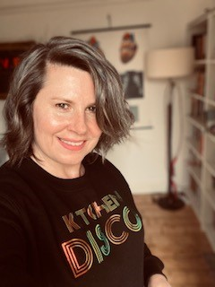

# Foreword by Dr Heather Cleland Woods {-}

 
 
**Wise Words by Bethany Shelton**

---

Looking through the images you have shared for this Yearbook, I came across the photo above which made me think of my Mum. It showed a Scottish saying that has been part of my life for as long as I can remember – ‘Whit’s Fir You’ll No Go By Ye’. It means something along the lines of 'if it’s meant for you it will happen' but I have never taken this saying as passive but more about having done all you can and now let things develop. My Mum has always said it to me at points where I have been anxious or worried that I haven’t done enough or done something right and I think it has stuck with me because, as someone who likes to have control of things (shocker, eh!), it has helped me hand over and let things be. 

Now is the time that I hand you all over and let you be. Be the collaborators who bring people together and get exciting projects started, the people who communicate their ideas and thoughts to get other people thinking in different ways about new things, the people who listen and hear, who challenge when required and reflect, to impart and build on your knowledge and share those skills that are highly valued by those that will now join your journey. To have reached this point, this year of all years, shows your determination and commitment to your field and Psychology is one lucky field to have such strong UofG graduates as the next generation. Be proud to be the graduating year of 2021. You will never be as proud of yourselves as we are of you. It’s been a pleasure to have walked this year of your journey with you but you don’t ever leave UofG Psychology, we are always by your side when you need us. Remember to give us a wave every now and then. 

I will leave you with the same final words that I shared with the Class of 2020 as they are always true; keep looking forward, take time to pause every now and then to enjoy the view, never EVER stop dancing.

Lang may yer lum reek!

**Heather**

