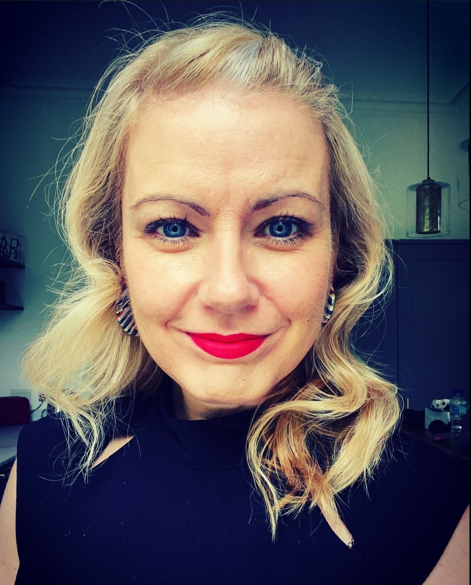
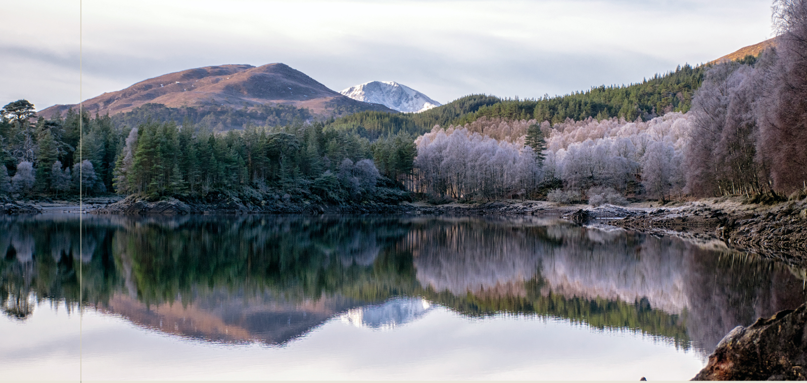

# A Fond Farewell from Prof Stack {-}

**Au revoir and not goodbye**

There are many things that I love about my job but Graduation is one of them and still after over 20 years in the job I find it a very emotional rite of passage and feel privileged to be part of the events that mark the end of your journey with us. 
Often in the 30 seconds or so that it takes to call out one of your names and see you walk across the dias to receive your hood from the Principal, numerous images and rememberings of each of you across your four years with us go through my mind, You may be leaving us but each of you leaves your own imprint on us and our community.

This year we can’t have this ceremony in person but I hope that in seeing the Graduation roll call that staff have created you can see we wanted to still pause and give space for these rememberings, these rites of passage and for each of you. 
Rites of passage mark endings but also beginnings. They remind us that change is possible.  They remind us that we can change. But change can be scary, so these rites of passage are also important because they also provide us with a sense of belonging, as they are organised by, and for, our community.  They strengthen our connections to each other even as we part ways for now and let us know we will always be welcome back.

But it is now time for you all to fly this nest and to face new challenges, learn new things, embrace new people and find new parts of you.  The Irish poet Seamus Heaney has a line in one of his poems that says ‘Walk on air against your better judgement’ and when he was asked what he meant in this, he said it is about accepting a little risk in our lives and ‘a sense that the marvellous is as permissible as the matter of fact’. So go out there and give yourself permission to be as marvellous as we know you are. 

Take care of you

**Niamh**
 
--- 

 “So fill to me the parting glass
 
And drink a health whate'er befalls

Then gently rise and softly call

Good night and joy be to you all”

---

Graduate, 

We wanted to mark your extraordinary journey with something that will grow on with you & remind you of your Scottish home.
Congratulations from us all at UofG Psychology.

**Trees for Life: Rewilding the Scottish Highlands** Your certificate will be mailed to you next week<a href="images/Lynda Young Tree Certificate.pdf" target = "_blank"> More detail here.</a>
 
 

 

