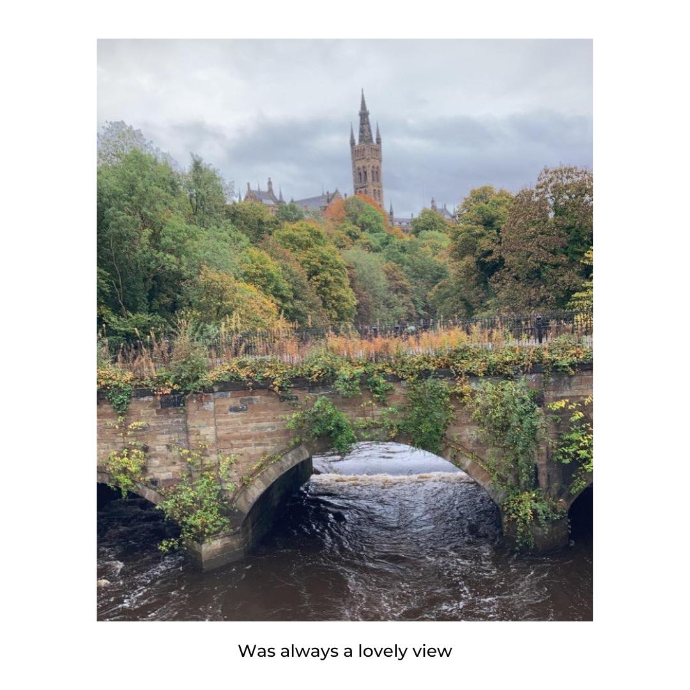

--- 
title: "Class of 2023 Yearbook"
author: "Dr Heather Cleland Woods"
date: "`r Sys.Date()`"
bibliography: packages.bib
description: UofG Psychology and Neuroscience Class of 2023 Yearbook
documentclass: book
link-citations: yes
site: bookdown::bookdown_site
biblio-style: apalike
---

```{r cite-packages, include = FALSE}
# automatically create a bib database for R packages
# add any packages you want to cite here
knitr::write_bib(c(
  .packages(), 'bookdown', 'tidyverse', 'broom', 'pwr', 'rtweet',
  'meme', 'gganimate', 'ggforce', 'knitr', 'faux', 'patchwork'
), 'packages.bib')

```

# Class of 2023 {-}


---

Yearbook for the University of Glasgow School of Psychology and Neuroscience 2022-2023. 

**Programme Lead:** Dr Heather Cleland Woods.

We hope you enjoy these snapshots of your time studying Psychology at Glasgow.

---

<div align = "center">
 
<br>
<span style = "float: right;">**by Lucia Feketova**</span>
</div>